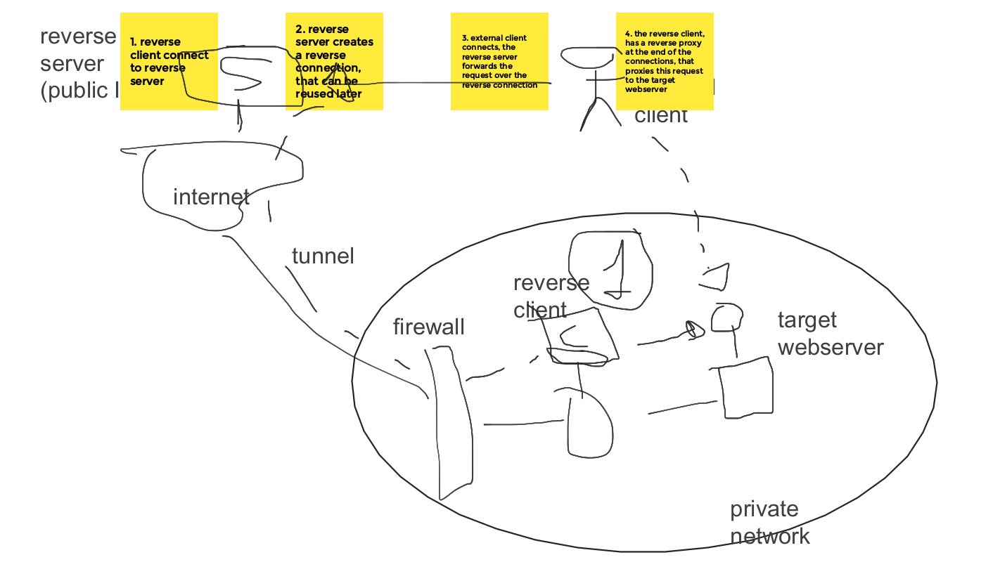

# h2rev2: Reverse proxy using http2 reverse connections

This package is based on https://pkg.go.dev/golang.org/x/build/revdial/v2 , however,
it uses HTTP2 to multiplex the reverse connections over HTTP2 streams, instead of using TCP connections.

This package implements a Dialer and Listener that works together to create reverse connections.

The motivation is that sometimes you want to run a server on a machine deep inside a NAT. 
Rather than connecting to the machine directly (which you can't, because of the NAT),
you have the sequestered machine connect out to a public machine.

The public machine runs the Dialer and the NAT machine the Listener.
The Listener opens a connections to the public machine that creates a reverse connection, so
the Dialer can use this connection to reach the NATed machine.

Typically, you would install a reverse proxy in the public machine and use the Dialer as a transport.

You can also install another reverse proxy in the NATed machine, to expose internal servers through this double reverse proxy chain.



## How to use it


### Public Server

The `Dialer` runs in a public server, it exposes one http handler that handles 2 URL paths:

- <base url>/revdial?key=id establish reverse connections and queue them so it can be consumed by the dialer
- <base url>/proxy/id/<path> proxies the <path> through the reverse connection identified by id

A common way to use it is:

```go
// initialize your middleware
mux := http.NewServeMux()

// add the reverse dialer to your router
dialer := h2rev2.NewDialer()
defer dialer.Close()
mux.Handle("/reverse/connections/", dialer)
```

### Internal Server

The `Listener` runs in the server that is not accessible from outside, it has to be able to connect to the server with the `Dialer` though.

An example on how to use it, is to use it as a reverse proxy of an internal network:

```go
// Create a client that is able to connect to the Dialer on the public server.
// You may want to use custom certificates for security.
caCert, err := ioutil.ReadFile("cert.crt")
if err != nil {
        log.Fatalf("Reading server certificate: %s", err)
}
caCertPool := x509.NewCertPool()
caCertPool.AppendCertsFromPEM(caCert)
tlsConfig = &tls.Config{
        RootCAs:            caCertPool,
        InsecureSkipVerify: false,
}
client := &http.Client{}
// remember this only works using http2 :-)
client.Transport = &http2.Transport{
        TLSClientConfig: tlsConfig,
}

// create the listener with the http.Client, the Dialer URL and an unique identifier for the Listener
l, err := h2rev2.NewListener(client, "https://mypublic.server.io/reverse/connections/", "revdialer0001")
if err != nil {
        panic(err)
}
defer l.Close()

// we are going to use the listener to receive the forwarded connections
// from the public server and proxy them to an internal host
// serve requests
mux := http.NewServeMux()
mux.HandleFunc("/", ProxyRequestHandler(proxy))
// Create a reverse proxy to an internal host
url, err := url.Parse("http://my.internal.host")
if err != nil {
        panic(err)
}
proxy := httputil.NewSingleHostReverseProxy(url)
mux.HandleFunc("/", proxy.ServeHTTP)
server := &http.Server{Handler: mux}
defer server.Close()
server.Serve(l)
```

### Clients
        
Now clients can use the public server url to connect to the proxied server in the internal network

```sh
curl -k https://public.server.url/reverse/connections/proxy/revdialer0001/internal/path
```
